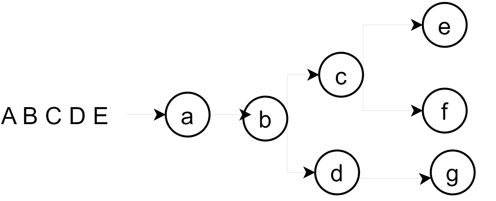
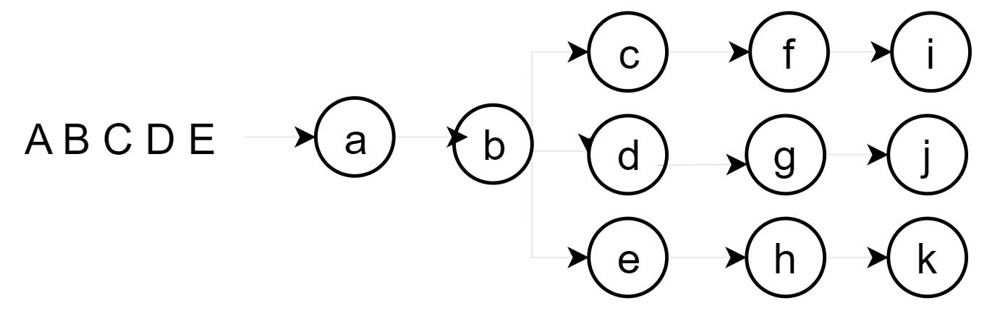
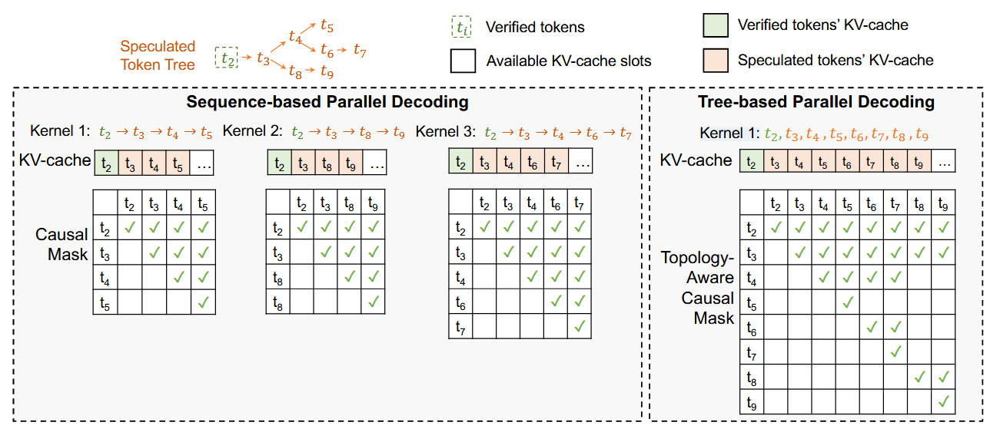

# NJUProject_Speculative_Decoding_Draft_Strategy

# 课程大作业：推测解码的draft策略分析

## 一、任务说明

## 1.1 背景

Speculative Decoding（推测解码）是一种用于加速大型语言模型推理的技术，通过使用一个小型的draft模型预先生成候选token序列（draft tree），然后由大型目标模型进行验证和修正。其中，draft model生成的draft tree的构建策略对整个解码过程的效率至关重要，不同的构建策略会导致不同的接受长度和接受率，从而影响整体推理速度。

## 1.2 推测解码

Speculative Decoding的核心思想是：

1. 使用一个小型、快速的draft模型预先生成多个候选token序列（draft tree）
2. 然后使用大型目标模型并行验证这些候选序列
3. 接受那些与目标模型预测一致的token，拒绝不一致的并重新生成
4. 通过这种方式减少目标模型的调用次数，从而加速推理过程

[大模型推理妙招—投机采样（Speculative Decoding） - 知乎](https://zhuanlan.zhihu.com/p/651359908)

## 1.3 推测解码的draft策略

小模型生成的draft可以是一个序列，也可以是一个树。

例如输入ABCDE，可以构建abcde这样的顺序draft。

也可以构建以下这样的树形draft。

draft策略会影响最终有多少token会被target model成功验证。本项目就是分析不同draft形式下的token接受率。

# 二、方法设计规范

## 2.1 draft效率分析（必选）

* draft model选择小模型，例如Llama-160M（[Felladrin/Llama-160M-Chat-v1 · Hugging Face](https://huggingface.co/Felladrin/Llama-160M-Chat-v1)）、Llama-1B([meta-llama/Llama-3.2-1B · Hugging Face](https://huggingface.co/meta-llama/Llama-3.2-1B)).
* target model选择较大模型，例如Llama-3B，或者更大的Llama-7B（可以使用google colab，[LLM实践-Colab T4 GPU推理Chinese-Llama-2-7b-4bit - 知乎](https://zhuanlan.zhihu.com/p/685046028)）
* 需要提出一些draft tree的可能形状，并填充不同数量的draft tokens，在不同draft-target model组合下，测量draft token接受率和接受长度。

## 2.2 tree-attention计算效率（可选）

在target model verified的时候，attention部分需要执行tree-attention。

如下图，如果每个sequence顺序地计算attention，需要执行多次attention kernel；但如果像右边一样，通过合理配置attention causal mask，就可以实现一次attention计算所有sequence。

你需要实现tree-attention，并分析tree-attention在不同的batchsize、sequence length、draft length情况下的执行时间。

> 参考资料：
>
> Xupeng Miao, Gabriele Oliaro, Zhihao Zhang, Xinhao Cheng, Zeyu Wang, Zhengxin Zhang, Rae Ying Yee Wong, Alan Zhu, Lijie Yang, Xiaoxiang Shi, Chunan Shi, Zhuoming Chen, Daiyaan Arfeen, Reyna Abhyankar, and Zhihao Jia. 2024. SpecInfer: Accelerating Large Language Model Serving with Tree-based Speculative Inference and Verification. In Proceedings of the 29th ACM International Conference on Architectural Support for Programming Languages and Operating Systems, Volume 3 (ASPLOS '24), Vol. 3. Association for Computing Machinery, New York, NY, USA, 932–949. https://doi.org/10.1145/3620666.3651335

# 三、实验要求

1. draft效率分析(必选)
   * 提出一些draft tree的可能形状
   * 填充**不同数量的draft tokens**，在不同draft-target model组合下，测量draft token**接受率和接受长度**。
     * 接受率：被成功验证的token数量/总体draft token数量
     * 接受长度：被成功验证的token数量
2. tree-attention计算效率（可选）
   * tree-attention在不同的**batchsize、sequence length、draft length**情况下的**执行时间**

# 四、提交内容

1. **代码**

   * 代码结构不做要求
   * 要给出能够运行的python环境（requirement.txt）
   * 要给出能成功运行代码的脚本

2. **报告**

   * 实现方法：详细描述实现方法

   - 实验结果：展示不同配置下draft token接受率和接受长度（以及tree-attention在不同配置下的执行时间）
   - 结果分析：对以上实验结果进行分析

# 五、注意事项

**参考文献：** 如果你在实验和报告中参考了已发表的文献，请列出你所参考的相关文献。

**截止日期：** 2025年6月20日 23:59（UTC+8）。

如有疑问，请联系 wzbwangzhibin@gmail.com 或 zzhbrr@gmail.com。
